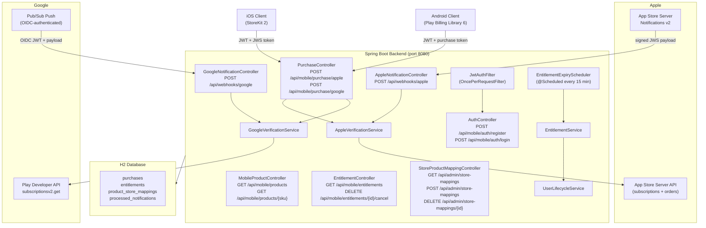
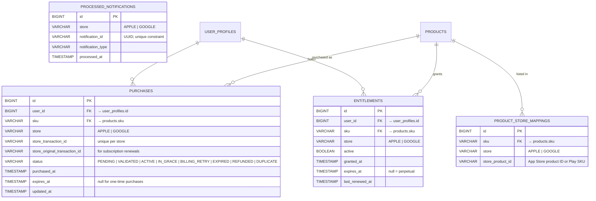
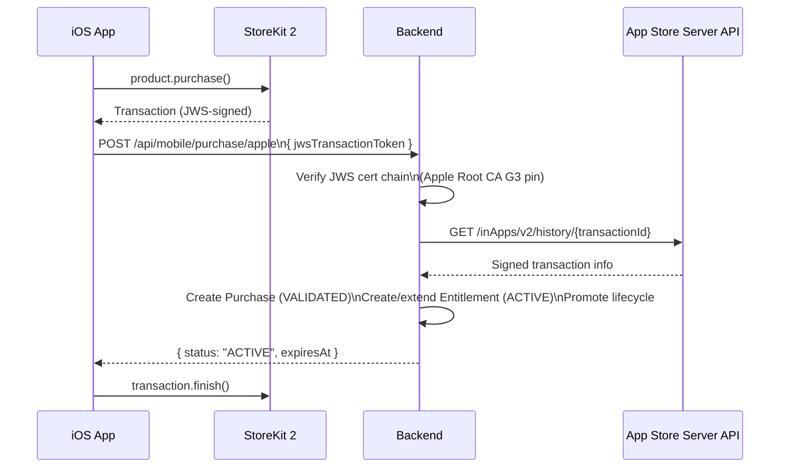
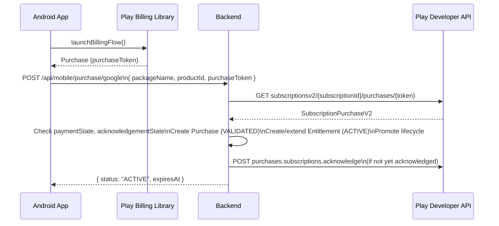

# Native Apps Integration — Design Document

iOS App Store (StoreKit 2) and Android Play Store (Play Billing Library 6) integration with the ecommerce backend.

---

## Overview

This document describes how the Spring Boot backend extends to support in-app purchases from iOS and Android native clients. The backend handles:

1. **JWT authentication** — issues and validates mobile session tokens
2. **Purchase verification** — validates receipts/tokens with Apple and Google servers
3. **Entitlement management** — tracks what a user has purchased and whether it is active
4. **Webhook processing** — receives server-to-server notifications from Apple and Google to keep entitlement state current
5. **Lifecycle promotion** — auto-upgrades `customerStatus` and `loyaltyTier` as users accumulate purchases

---

## Architecture



---

## Data Model

### New Entities



> **`PROCESSED_NOTIFICATIONS`** provides idempotency. Before processing any webhook, the backend inserts the notification ID. If the insert violates the unique constraint, the notification is a duplicate and is silently discarded.

---

## Purchase State Machine

```mermaid
stateDiagram-v2
    [*] --> PENDING : Client sends token to backend

    PENDING --> VALIDATED : Apple/Google confirms transaction
    PENDING --> EXPIRED : Verification fails (invalid token)

    VALIDATED --> ACTIVE : Entitlement created/extended
    VALIDATED --> DUPLICATE : store_transaction_id already exists

    ACTIVE --> IN_GRACE : Payment fails; grace period starts\n(Apple: up to 16 days; Google: configurable)
    ACTIVE --> BILLING_RETRY : Past grace period; still retrying
    ACTIVE --> EXPIRED : Subscription not renewed / cancelled
    ACTIVE --> REFUNDED : Apple/Google issues refund

    IN_GRACE --> ACTIVE : Payment recovered
    IN_GRACE --> BILLING_RETRY : Grace period elapsed
    BILLING_RETRY --> ACTIVE : Payment recovered
    BILLING_RETRY --> EXPIRED : Max retries exceeded

    REFUNDED --> [*]
    EXPIRED --> [*]
    DUPLICATE --> [*]
```



---

## REST API

### Authentication

| Method | Path | Auth | Description |
|--------|------|------|-------------|
| `POST` | `/api/mobile/auth/register` | None | Register a new mobile user; returns JWT |
| `POST` | `/api/mobile/auth/login` | None | Authenticate existing user; returns JWT |

**Register request:**
```json
{
  "name": "Jane Doe",
  "email": "jane@example.com",
  "password": "s3cr3t"
}
```

**Login response:**
```json
{
  "token": "<JWT>",
  "expiresIn": 86400
}
```

JWT payload includes `sub` (email), `uid` (user_profiles.id), `iat`, `exp`.

---

### Product Catalogue (Mobile)

| Method | Path | Auth | Description |
|--------|------|------|-------------|
| `GET` | `/api/mobile/products` | JWT | Active products with store IDs; filtered to user's eligibility |
| `GET` | `/api/mobile/products/{sku}` | JWT | Single product with store IDs |

Response includes `appleProductId` and `googleProductId` so clients can pass the right ID to StoreKit / Play Billing.

---

### Purchase Verification

| Method | Path | Auth | Description |
|--------|------|------|-------------|
| `POST` | `/api/mobile/purchase/apple` | JWT | Verify an Apple JWS transaction token |
| `POST` | `/api/mobile/purchase/google` | JWT | Verify a Google purchase token |

**Apple request:**
```json
{
  "jwsTransactionToken": "<signed JWS string from StoreKit 2>"
}
```

**Google request:**
```json
{
  "packageName": "com.example.ecommerce",
  "productId": "premium_monthly",
  "purchaseToken": "<token from Play Billing>"
}
```

**Shared response:**
```json
{
  "purchaseId": 42,
  "sku": "FINC-CCARD",
  "status": "ACTIVE",
  "expiresAt": "2026-05-07T00:00:00Z"
}
```

---

### Entitlements

| Method | Path | Auth | Description |
|--------|------|------|-------------|
| `GET` | `/api/mobile/entitlements` | JWT | All active entitlements for the authenticated user |
| `DELETE` | `/api/mobile/entitlements/{id}/cancel` | JWT | Request cancellation (triggers store-side cancel flow) |

---

### Webhooks

| Method | Path | Auth | Description |
|--------|------|------|-------------|
| `POST` | `/api/webhooks/apple` | Apple JWS signature | App Store Server Notifications v2 |
| `POST` | `/api/webhooks/google` | Google OIDC JWT | Google Play Real-time Developer Notifications |

Both endpoints return `200 OK` immediately. Processing is synchronous but idempotent (see `PROCESSED_NOTIFICATIONS`).

---

### Admin — Store Mappings

| Method | Path | Auth | Description |
|--------|------|------|-------------|
| `GET` | `/api/admin/store-mappings` | JWT (ADMIN role) | List all product↔store ID mappings |
| `POST` | `/api/admin/store-mappings` | JWT (ADMIN role) | Create a mapping |
| `DELETE` | `/api/admin/store-mappings/{id}` | JWT (ADMIN role) | Remove a mapping |

---

## Apple Integration

### StoreKit 2 Flow



### JWS Verification

- Library: **Nimbus JOSE+JWT** (`com.nimbusds:nimbus-jose-jwt:9.40`)
- Certificate chain in the JWS header is verified against Apple Root CA G3 (pinned as a classpath resource)
- Leaf certificate is checked for `1.2.840.113635.100.6.11.1` OID (Apple Worldwide Developer Relations)
- Signature algorithm: `ES256`

### App Store Server Notifications v2 — Handled Types

| Notification Type | Subtypes | Action |
|---|---|---|
| `DID_RENEW` | — | Extend entitlement; clear grace/retry state |
| `EXPIRED` | `VOLUNTARY`, `BILLING_RETRY`, `PRICE_INCREASE` | Mark entitlement expired |
| `DID_FAIL_TO_RENEW` | `GRACE_PERIOD` / none | Move to IN_GRACE or BILLING_RETRY |
| `GRACE_PERIOD_EXPIRED` | — | Move BILLING_RETRY → EXPIRED |
| `REFUND` | — | Revoke entitlement; mark REFUNDED |
| `REVOKE` | — | Family sharing revoked; revoke entitlement |
| `SUBSCRIBED` | `INITIAL_BUY`, `RESUBSCRIBE` | Create/reactivate entitlement |
| `DID_CHANGE_RENEWAL_STATUS` | `AUTO_RENEW_DISABLED` | Flag; do not expire yet |
| `PRICE_INCREASE` | `ACCEPTED`, `PENDING` | Log only |
| `CONSUMPTION_REQUEST` | — | Log only |
| `ONE_TIME_CHARGE` | — | Create one-time purchase record |
| `RENEWAL_EXTENDED` | — | Extend entitlement by extended duration |

---

## Google Integration

### Play Billing Flow



### Play Developer API

- API: **Google Play Developer API v3** (`com.google.apis:google-api-services-androidpublisher`)
- Auth: service account JSON (path from `GOOGLE_SERVICE_ACCOUNT_PATH` env var)
- Acknowledgement: must be done within 3 days or Google refunds automatically

### Real-time Developer Notifications (Pub/Sub)

- Pub/Sub pushes a JSON payload to `/api/webhooks/google`
- The HTTP `Authorization` header contains a Google-signed OIDC JWT; the backend verifies it against Google's public key endpoint
- Notification type decoded from `subscriptionNotification.notificationType` (int)

| Type | Value | Action |
|---|---|---|
| `SUBSCRIPTION_RECOVERED` | 1 | BILLING_RETRY → ACTIVE |
| `SUBSCRIPTION_RENEWED` | 2 | Extend entitlement |
| `SUBSCRIPTION_CANCELED` | 3 | Mark will-not-renew; do not expire yet |
| `SUBSCRIPTION_PURCHASED` | 4 | Create entitlement |
| `SUBSCRIPTION_ON_HOLD` | 5 | Move to BILLING_RETRY |
| `SUBSCRIPTION_IN_GRACE_PERIOD` | 6 | Move to IN_GRACE |
| `SUBSCRIPTION_RESTARTED` | 7 | Reactivate entitlement |
| `SUBSCRIPTION_PRICE_CHANGE_CONFIRMED` | 8 | Log only |
| `SUBSCRIPTION_DEFERRED` | 9 | Extend entitlement by deferred amount |
| `SUBSCRIPTION_PAUSED` | 10 | Pause; block access |
| `SUBSCRIPTION_PAUSE_SCHEDULE_CHANGED` | 11 | Log only |
| `SUBSCRIPTION_REVOKED` | 12 | Revoke entitlement |
| `SUBSCRIPTION_EXPIRED` | 13 | Mark EXPIRED |

---

## Lifecycle Auto-Promotion

`UserLifecycleService` is called after every successful purchase validation. It reads the user's total purchase count from the `purchases` table and updates `user_profiles.customer_status` and `user_profiles.loyalty_tier` accordingly.

### CustomerStatus thresholds

| Purchase count | Status |
|---|---|
| 0 | `NEW` |
| ≥ 1 | `RETURNING` |
| ≥ 5 | `LOYAL` |
| ≥ 15 | `VIP` |

> `AT_RISK` is set externally (churn signals) and is not overwritten by this service.

### LoyaltyTier thresholds

| Purchase count | Tier |
|---|---|
| 0–2 | `NONE` |
| 3–6 | `BRONZE` |
| 7–14 | `SILVER` |
| 15–29 | `GOLD` |
| ≥ 30 | `PLATINUM` |

---

## Entitlement Expiry Scheduler

`EntitlementExpiryScheduler` runs every 15 minutes via `@Scheduled(fixedDelay = 900_000)`. It queries `entitlements` for rows where `active = true AND expires_at < NOW()` and marks them inactive. This is a safety net — webhook-driven transitions are the primary mechanism.

---

## Security

### JWT

- Library: **JJWT** (`io.jsonwebtoken:jjwt-*:0.12.6`)
- Algorithm: `HS256`, secret from `JWT_SECRET` environment variable (≥ 256-bit)
- Expiry: 24 hours (configurable via `JWT_EXPIRY_SECONDS`)
- `JwtAuthFilter` extends `OncePerRequestFilter`; sets a `UsernamePasswordAuthenticationToken` in the `SecurityContext`

### Public endpoints (no JWT required)

```
POST /api/mobile/auth/register
POST /api/mobile/auth/login
POST /api/webhooks/apple
POST /api/webhooks/google
```

Webhook endpoints are secured by payload signature, not JWT.

### Replay prevention

- Apple webhooks: `notificationUUID` inserted into `processed_notifications` with a unique constraint
- Google webhooks: `message.messageId` used as the notification ID for the same constraint
- Insert-then-process ordering: duplicate inserts throw a constraint violation before any state changes

### Apple certificate pinning

Apple Root CA G3 (`.cer` file) stored at `src/main/resources/apple/AppleRootCA-G3.cer`. Verified on every JWS decode.

### Google OIDC verification

Google's public JWKS endpoint (`accounts.google.com`) is fetched on first use and cached. The `email` claim in the OIDC token must end with `@pubsub.gserviceaccount.com` and the `audience` must match the backend's webhook URL.

### Rate limiting

**Bucket4j** applied to purchase endpoints:

| Endpoint | Limit |
|---|---|
| `POST /api/mobile/purchase/apple` | 10 requests / user / minute |
| `POST /api/mobile/purchase/google` | 10 requests / user / minute |
| `POST /api/mobile/auth/login` | 20 requests / IP / minute |

---

## Environment Variables

| Variable | Required | Description |
|---|---|---|
| `JWT_SECRET` | Yes | HS256 signing key (≥ 32 chars) |
| `JWT_EXPIRY_SECONDS` | No (default 86400) | Token lifetime |
| `APPLE_KEY_ID` | Yes | App Store Connect API key ID |
| `APPLE_ISSUER_ID` | Yes | App Store Connect issuer UUID |
| `APPLE_PRIVATE_KEY_PATH` | Yes | Path to `.p8` private key file |
| `APPLE_BUNDLE_ID` | Yes | App bundle identifier |
| `APPLE_ENVIRONMENT` | No (default `PRODUCTION`) | `SANDBOX` or `PRODUCTION` |
| `GOOGLE_SERVICE_ACCOUNT_PATH` | Yes | Path to service account JSON |
| `GOOGLE_PACKAGE_NAME` | Yes | Android app package name |

---

## Package Structure

```
com.ecommerce/
├── controller/
│   ├── AuthController.java
│   ├── MobileProductController.java
│   ├── PurchaseController.java
│   ├── EntitlementController.java
│   ├── AppleNotificationController.java
│   ├── GoogleNotificationController.java
│   └── StoreProductMappingController.java
├── model/
│   ├── Product.java              (existing)
│   ├── SubscriptionProduct.java  (existing)
│   ├── UserProfile.java          (existing)
│   ├── ProductStoreMapping.java  (new)
│   ├── Purchase.java             (new)
│   ├── Entitlement.java          (new)
│   └── ProcessedNotification.java (new)
├── dto/
│   ├── ApplePurchaseRequest.java
│   ├── GooglePurchaseRequest.java
│   ├── PurchaseResponse.java
│   ├── MobileAuthRequest.java
│   ├── MobileLoginRequest.java
│   └── TokenResponse.java
├── service/
│   ├── ProductRecommendationService.java  (existing)
│   ├── ProductService.java               (existing)
│   ├── AppleVerificationService.java     (new)
│   ├── GoogleVerificationService.java    (new)
│   ├── EntitlementService.java           (new)
│   ├── UserLifecycleService.java         (new)
│   └── JwtService.java                   (new)
├── repository/
│   ├── ProductRepository.java           (existing)
│   ├── UserProfileRepository.java       (existing)
│   ├── PurchaseRepository.java          (new)
│   ├── EntitlementRepository.java       (new)
│   ├── ProductStoreMappingRepository.java (new)
│   └── ProcessedNotificationRepository.java (new)
├── security/
│   ├── JwtAuthFilter.java
│   └── SecurityConfig.java
└── scheduler/
    └── EntitlementExpiryScheduler.java
```

---

## New Maven Dependencies

```xml
<!-- JWT -->
<dependency>
    <groupId>io.jsonwebtoken</groupId>
    <artifactId>jjwt-api</artifactId>
    <version>0.12.6</version>
</dependency>
<dependency>
    <groupId>io.jsonwebtoken</groupId>
    <artifactId>jjwt-impl</artifactId>
    <version>0.12.6</version>
    <scope>runtime</scope>
</dependency>
<dependency>
    <groupId>io.jsonwebtoken</groupId>
    <artifactId>jjwt-jackson</artifactId>
    <version>0.12.6</version>
    <scope>runtime</scope>
</dependency>

<!-- Spring Security -->
<dependency>
    <groupId>org.springframework.boot</groupId>
    <artifactId>spring-boot-starter-security</artifactId>
</dependency>

<!-- Apple JWS verification -->
<dependency>
    <groupId>com.nimbusds</groupId>
    <artifactId>nimbus-jose-jwt</artifactId>
    <version>9.40</version>
</dependency>

<!-- Google Play Developer API -->
<dependency>
    <groupId>com.google.apis</groupId>
    <artifactId>google-api-services-androidpublisher</artifactId>
    <version>v3-rev20240730-2.0.0</version>
</dependency>
<dependency>
    <groupId>com.google.auth</groupId>
    <artifactId>google-auth-library-oauth2-http</artifactId>
    <version>1.23.0</version>
</dependency>

<!-- Rate limiting -->
<dependency>
    <groupId>com.github.vladimir-bukhtoyarov</groupId>
    <artifactId>bucket4j-core</artifactId>
    <version>8.10.1</version>
</dependency>
```

---

## Implementation Phases

### Phase 1 — Foundation (no breaking changes)
1. Add Maven dependencies (JWT, Security, Nimbus, Google APIs, Bucket4j)
2. Create `JwtService` (sign + validate)
3. Create `SecurityConfig` (permit webhooks + auth; require JWT elsewhere)
4. Create `JwtAuthFilter`
5. Create `AuthController` (register + login)

### Phase 2 — Store Mapping
6. Create `ProductStoreMapping` entity + repository
7. Create `StoreProductMappingController` (admin CRUD)
8. Seed initial mappings in `data.sql`

### Phase 3 — Apple Verification
9. Add Apple Root CA G3 cert to `src/main/resources/apple/`
10. Create `AppleVerificationService` (JWS decode + cert chain pin + App Store Server API call)
11. Create `Purchase` entity + `PurchaseRepository`

### Phase 4 — Google Verification
12. Create `GoogleVerificationService` (Play Developer API call + acknowledgement)
13. Add service account JSON path wiring via `@Value`

### Phase 5 — Purchase Endpoint
14. Create `PurchaseController` (`/apple` + `/google`)
15. Apply Bucket4j rate limit interceptor

### Phase 6 — Entitlement Engine
16. Create `Entitlement` entity + `EntitlementRepository`
17. Create `EntitlementService` (create, extend, revoke, query)
18. Create `EntitlementController`
19. Create `EntitlementExpiryScheduler`

### Phase 7 — Lifecycle Promotion
20. Create `UserLifecycleService`
21. Wire into `EntitlementService.activate()`

### Phase 8 — Apple Webhooks
22. Create `ProcessedNotification` entity + repository
23. Create `AppleNotificationController`
24. Handle all 12 notification types in `AppleVerificationService`

### Phase 9 — Google Webhooks
25. Create `GoogleNotificationController`
26. Implement OIDC JWT verification for Pub/Sub
27. Handle all 13 notification types in `GoogleVerificationService`

### Phase 10 — Mobile Product Endpoint
28. Create `MobileProductController` (catalogue with store IDs, eligibility-filtered)
29. End-to-end integration tests for both purchase flows
30. Update `data.sql` with store mapping seed rows

---

## Database Schema Changes

All new tables are added to the H2 `create-drop` schema automatically via JPA. No manual migration required.

```sql
-- Conceptual DDL (generated by Hibernate)

CREATE TABLE product_store_mappings (
    id BIGINT AUTO_INCREMENT PRIMARY KEY,
    sku VARCHAR(20) NOT NULL REFERENCES products(sku),
    store VARCHAR(10) NOT NULL,          -- APPLE | GOOGLE
    store_product_id VARCHAR(200) NOT NULL,
    UNIQUE (sku, store)
);

CREATE TABLE purchases (
    id BIGINT AUTO_INCREMENT PRIMARY KEY,
    user_id BIGINT NOT NULL REFERENCES user_profiles(id),
    sku VARCHAR(20) NOT NULL REFERENCES products(sku),
    store VARCHAR(10) NOT NULL,
    store_transaction_id VARCHAR(200) NOT NULL,
    store_original_transaction_id VARCHAR(200),
    status VARCHAR(20) NOT NULL,
    purchased_at TIMESTAMP NOT NULL,
    expires_at TIMESTAMP,
    updated_at TIMESTAMP NOT NULL,
    UNIQUE (store, store_transaction_id)
);

CREATE TABLE entitlements (
    id BIGINT AUTO_INCREMENT PRIMARY KEY,
    user_id BIGINT NOT NULL REFERENCES user_profiles(id),
    sku VARCHAR(20) NOT NULL REFERENCES products(sku),
    store VARCHAR(10) NOT NULL,
    active BOOLEAN NOT NULL DEFAULT TRUE,
    granted_at TIMESTAMP NOT NULL,
    expires_at TIMESTAMP,
    last_renewed_at TIMESTAMP,
    UNIQUE (user_id, sku, store)
);

CREATE TABLE processed_notifications (
    id BIGINT AUTO_INCREMENT PRIMARY KEY,
    store VARCHAR(10) NOT NULL,
    notification_id VARCHAR(200) NOT NULL,
    notification_type VARCHAR(50),
    processed_at TIMESTAMP NOT NULL,
    UNIQUE (store, notification_id)
);
```

---

## Key Design Decisions

| Decision | Rationale |
|---|---|
| StoreKit 2 JWS (not legacy receipts) | Apple deprecated receipt validation; JWS is the current standard |
| Nimbus JOSE+JWT for JWS | Battle-tested; handles ES256 cert chain natively |
| Play subscriptionsv2 (not v1) | v1 deprecated; v2 returns `LinkedPurchaseToken` for upgrade/downgrade chains |
| Synchronous webhook processing | Simplicity; idempotency via `PROCESSED_NOTIFICATIONS` handles retries |
| `UNIQUE (store, store_transaction_id)` on purchases | Prevents duplicate entitlements from race conditions or webhook replays |
| `UNIQUE (user_id, sku, store)` on entitlements | One entitlement record per user+product+store; `active` flag and `expires_at` updated in place |
| Lifecycle promotion on purchase, not on webhook | Webhook-driven promotion adds latency; purchase validation is the authoritative event |
| H2 `create-drop` retained | Development convenience; switching to a persistent DB for production requires only `application.properties` changes |
