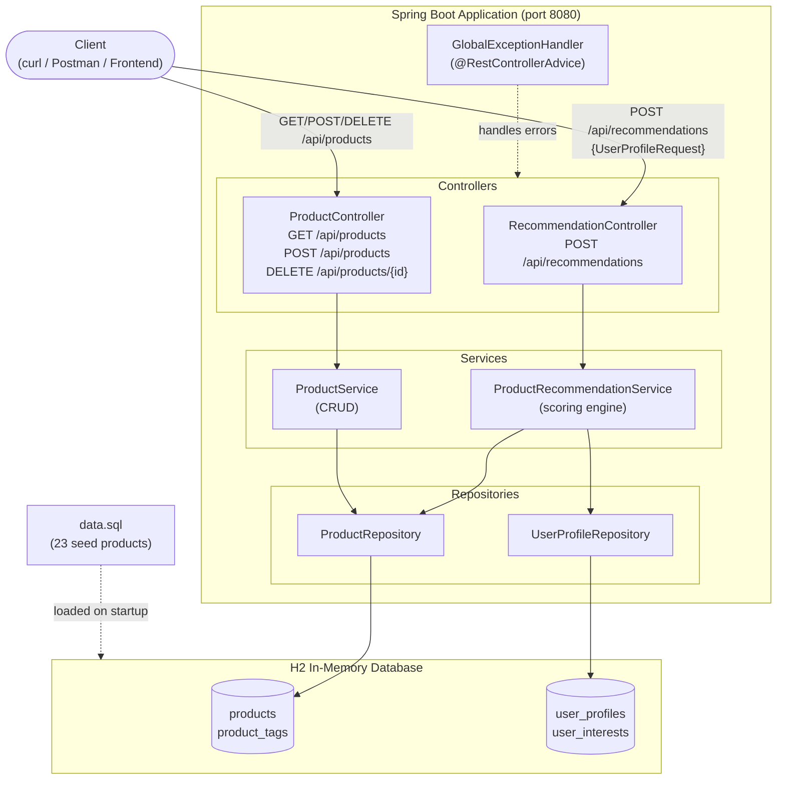
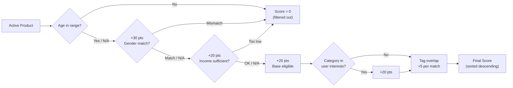

# Ecommerce Product Recommendation System

A Spring Boot REST API that accepts a user profile and returns a ranked list of applicable products based on age, gender, income level, and category interests.

---

## Architecture



---

## Recommendation Scoring

When a user profile is submitted, every active product is scored. Products scoring 0 are excluded; the rest are returned sorted by score descending.



---

## Tech Stack

| Layer | Technology |
|---|---|
| Language | Java 17 |
| Framework | Spring Boot 3.2 |
| Persistence | Spring Data JPA + H2 (in-memory) |
| Validation | Jakarta Bean Validation |
| Build | Maven |
| Boilerplate reduction | Lombok |

---

## Getting Started

### Prerequisites
- Java 17+
- Maven 3.8+

### Run

```bash
git clone https://github.com/asojha/ecommerce.git
cd ecommerce
mvn spring-boot:run
```

The app starts on **http://localhost:8080** and seeds 23 products automatically.

### H2 Console

Browse the in-memory database at **http://localhost:8080/h2-console**

| Field | Value |
|---|---|
| JDBC URL | `jdbc:h2:mem:ecommercedb` |
| Username | `sa` |
| Password | _(blank)_ |

### Run Tests

```bash
mvn test
```

---

## API Reference

### `POST /api/recommendations`

Submit a user profile and receive a ranked product list.

**Request body:**

```json
{
  "name": "Jane Doe",
  "email": "jane@example.com",
  "age": 28,
  "gender": "FEMALE",
  "incomeLevel": "MEDIUM",
  "location": "New York",
  "interests": ["ELECTRONICS", "SPORTS", "HEALTH"]
}
```

**Accepted enum values:**

| Field | Values |
|---|---|
| `gender` | `MALE`, `FEMALE` |
| `incomeLevel` | `LOW`, `MEDIUM`, `HIGH`, `PREMIUM` |
| `interests` | `ELECTRONICS`, `FASHION`, `HOME_AND_KITCHEN`, `SPORTS`, `BEAUTY`, `BOOKS`, `TOYS`, `FOOD_AND_GROCERY`, `AUTOMOTIVE`, `HEALTH`, `TRAVEL`, `FINANCE` |

**Response:**

```json
{
  "userEmail": "jane@example.com",
  "userName": "Jane Doe",
  "totalProducts": 12,
  "products": [
    {
      "id": 1,
      "name": "iPhone 15 Pro",
      "description": "Latest Apple smartphone with A17 chip",
      "price": 999.99,
      "category": "ELECTRONICS",
      "tags": ["ELECTRONICS", "tech", "premium"],
      "imageUrl": "https://example.com/iphone15pro.jpg",
      "matchScore": 90
    },
    ...
  ]
}
```

---

### `GET /api/products`

Returns all active products.

---

### `GET /api/products/{id}`

Returns a single product by ID.

---

### `POST /api/products`

Add a new product.

```json
{
  "name": "Wireless Headphones",
  "description": "Noise-cancelling over-ear headphones",
  "price": 249.99,
  "category": "ELECTRONICS",
  "minAge": 13,
  "targetGender": "ALL",
  "minIncomeLevel": "LOW",
  "tags": ["ELECTRONICS", "audio"],
  "active": true
}
```

---

### `DELETE /api/products/{id}`

Soft-deletes a product (sets `active = false`).

---

## Project Structure

```
ecommerce/
├── pom.xml
└── src/
    ├── main/
    │   ├── java/com/ecommerce/
    │   │   ├── EcommerceApplication.java
    │   │   ├── controller/
    │   │   │   ├── RecommendationController.java  # POST /api/recommendations
    │   │   │   └── ProductController.java          # CRUD /api/products
    │   │   ├── dto/
    │   │   │   ├── UserProfileRequest.java         # inbound user profile
    │   │   │   ├── ProductResponse.java            # outbound product + score
    │   │   │   └── RecommendationResponse.java     # outbound wrapper
    │   │   ├── model/
    │   │   │   ├── Product.java                    # product entity + enums
    │   │   │   └── UserProfile.java                # user profile entity
    │   │   ├── repository/
    │   │   │   ├── ProductRepository.java
    │   │   │   └── UserProfileRepository.java
    │   │   ├── service/
    │   │   │   ├── ProductRecommendationService.java  # scoring engine
    │   │   │   └── ProductService.java                # product CRUD
    │   │   └── exception/
    │   │       └── GlobalExceptionHandler.java
    │   └── resources/
    │       ├── application.properties
    │       └── data.sql                            # 23 seed products
    └── test/
        └── java/com/ecommerce/
            └── RecommendationServiceTest.java
```
